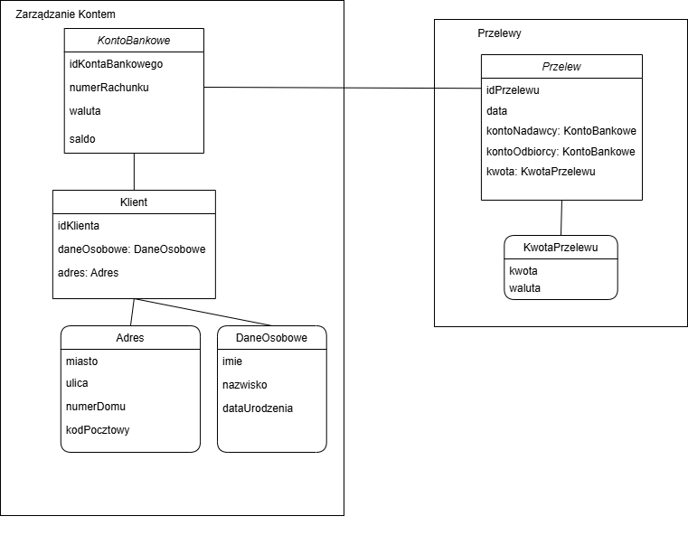

# Zadanie 1 - Domain Driven Design

Zadanie miało na celu zamodelowanie fragmentu aplikacji bankowej.  Zdefiniowano dwa konteksty: Zarządzanie Kontem, Przelewy, w których zdefiniowano odpowiednio agregaty: KontoBankowe i Przelew oraz odpowiednie encje i obiekty wartości: Klient, Adres, DaneOsobowe, KwotaPrzelewu. Finalnie, przedstawiono ograniczenia encji i opiusano możliwe operacje pomiędzy obiektami/kontekstami.

# Model

# Przyjęte założenia i ograniczenia

### Konteksty

- Zarządzanie Kontem - kontekst dotyczący funkcji związanych z kontem bankowym tj.: sprawdzenie salda konta bankowego, sprawdzenie klienta należącego do konta, aktualizację danych osobowych, adresu klienta dla jego konta
- Przelewy - kontekst dotyczący funkcji związanych z przelewami: tj.: wykonanie przelewu na dane konto bankowe

### Agregaty

- KontoBankowe
    - opis: reprezentuje konto bankowe danego klienta
    - jako agregat zawiera encję Klienta oraz obiekty wartości: Adres, DaneOsobowe
    - możliwe operacje: wykonanie przelewu z danego konta, sprawdzenie salda w danej walucie
- Przelew
    - opis: reprezentuje przelew wykonany z konta bankowego na dane konto bankowe
    - możliwe operacje: wykonanie przelewu w danej kwocie i walucie

### Encje

- Klient
    - opis: reprezentuje klienta posiadającego konto bankowe
    - zawiera obiekty wartości: Adres, DaneOsobowe
    - możliwe operacje: aktualizacja danych osobowych i adresu klienta

### Obiekty wartości

- Adres - adres klienta
- DaneOsobowe - dane osobowe klienta
- KwotaPrzelewu - kwota przelewu w danej walucie

| Obiekt | Atrybut | Dopuszczalny format | Założenia | Opis |
| --- | --- | --- | --- | --- |
| KontoBankowe | idKontaBankowego | long | Unikalna liczba > 0 | Unikalny identyfikator konta bankowego |
|  | numerRachunku | string | dokładnie 26-cyfrowy numer zgodny z formatem IBAN | Numer rachunku bankowego |
|  | waluta | string | 3-znakowy kod waluty | Waluta konta bankowego |
|  | saldo | float | Dopuszczalne wartości ujemne | Dostępne środki na koncie bankowym |
| Klient | idKlienta | long | Unikalna liczba >0 | Unikalny identyfikator klienta |
|  | daneOsobowe | - | Takie jak w DaneOsobowe | Dane osobowe klienta |
|  | adres | - | Takie jak w Adres | Adres klienta |
| Adres | miasto | - | Do wyboru z listy  | - |
|  | ulica | string | maksymalnie 60 znaków, dozwolone znaki alfabetyczne | - |
|  | numerDomu | int | Wartość nieujemna | - |
|  | kodPocztowy | - | Dopuszczalny format XX-XXX, gdzie X to cyfra, dodatkowa weryfikacja kodu pocztowego | - |
| DaneOsobowe | imie | string | Minimum 2 znaki, maksymalnie 15, dozwolone znaki alfabetyczne | - |
|  | nazwisko | string | Minimum 2 znaki, maksymalnie 50, dozwolone znaki alfabetyczne | - |
|  | dataUrodzenia | string | Format daty YYYY-MM-DD, wymagana walidacja zakresu dat | - |
| Przelew | idPrzelewu | long | Unikalna liczba > 0 | Unikalny identyfikator przelewu |
|  | data | string | Format daty YYYY-MM-DD HH:MM:SS, wymagana walidacja zakresu dat | Data wykonania przelewu |
|  | kontoNadawcy | - | Takie jak w KontoBankowe | Numer rachunku Nadawcy |
|  | kontoOdbiorcy | - | Takie jak w KontoBankowe | Numer rachunku Odbiorcy |
|  | kwota | - | taka jak KwotaPrzelewu |  |
| KwotaPrzelewu | kwota | int | Wartość nieujemna | Kwota wykonanego przelewu |
|  | waluta | string | 3-znakowy kod waluty | Waluta przelewu, zgodna z walutą konta nadawcy i odbiorcy |